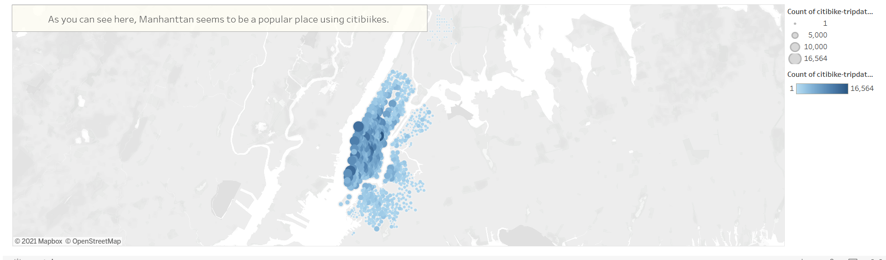

# bikesharing
[link to dashboard](https://public.tableau.com/app/profile/shirley.osorio/viz/NYCCitibikeAnalysis_16319972909730/NYCCitibikeAnalysis?publish=yes "link to dashboard")
## Overview of the analysis
The purpose of this analysis is to create a proposal that will show stakeholders to invest in a bike sharing program. According to statistics from a current ride sharing program, investors will see if it is worth investing in another city. Visualizations were created to show the length of time that bikes are checked out for all riders and genders, the number of bike trips for all riders and genders for each hour of each day of the week, and the number of bike trips for each type of user and gender for each day of the week. 
## Results
Below are the results and visualizations. 

## Summary
The analysis concluded several things. The peak times for bike rides are during the morning and late afternoon/evening and Thursday is the most popular day for bike riding. This could be because of work commute. The analysis also concluded the users were mostly males, and the average time of using a bike was 5 minutes. An additional visualization that could potentially help show stakeholders to invest is to compare data on another month with different weather. This could help see the difference in number of rides and be well prepared for those months. Another visualization could also be the distance between the bike rental locations and the users home. 
